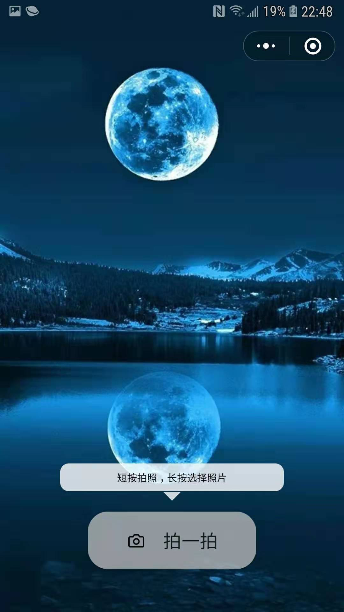

# **测试颜值**的小程序

###### 没有调用第三方框架，很简单的一个小程序！！！

------

直接调用官方demo

https://ai.qq.com/cgi-bin/appdemo_detectface


 [下载.jfif](..\下载.jfif) 




顺便采用些跳动的动画，仅此而已！

> ```
> onReady: function () {
> 
> ​    var circleCount = 0;
> 
> ​    // 心跳的外框动画 
> 
> ​    this.animationMiddleHeaderItem = wx.createAnimation({
> 
> ​      duration: 1000, // 以毫秒为单位 
> 
> ​      timingFunction: 'linear',
> 
> ​      delay: 100,
> 
> ​      transformOrigin: '50% 50%',
> 
> ​      success: function (res) {
> 
> ​      }
> 
> ​    });
> 
> ​    setInterval(function () {
> 
> ​      if (circleCount % 2 == 0) {
> 
> ​        this.animationMiddleHeaderItem.scale(1.15).step();
> 
> ​      } else {
> 
> ​        this.animationMiddleHeaderItem.scale(1.0).step();
> 
> ​      }
> 
> ​      this.setData({
> 
> ​        animationMiddleHeaderItem: this.animationMiddleHeaderItem.export()
> 
> ​      });
> 
> ​      circleCount++;
> 
> ​      if (circleCount == 1000) {
> 
> ​        circleCount = 0;
> 
> ​      }
> 
> ​    }.bind(this), 1000);
> 
> ​    this.randDomText();
> 
>   },
> ```

